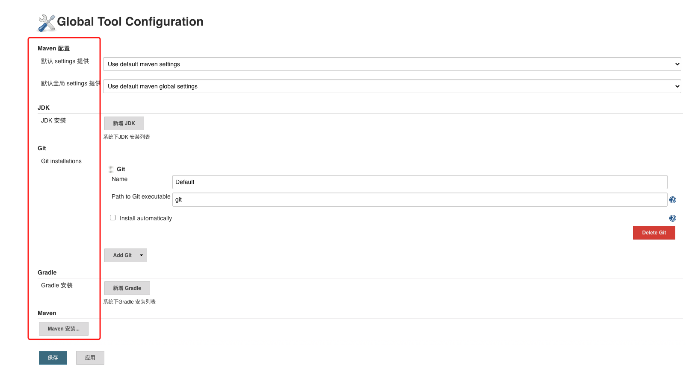
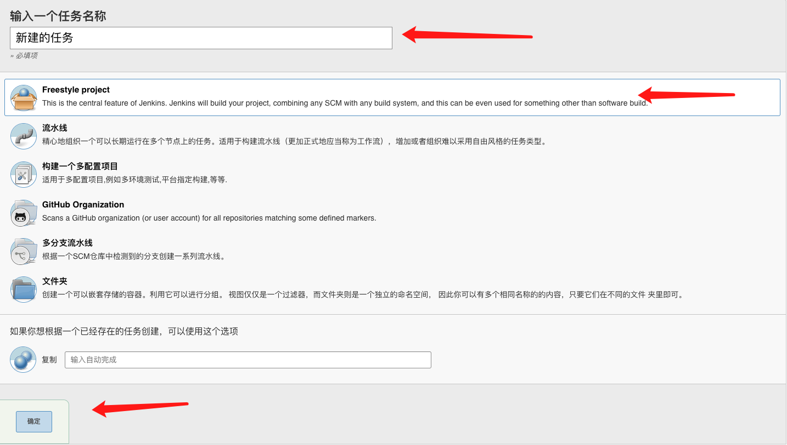

# Jenkins搭建并使用
## 1.Jenkins基本搭建
> 在安装Jenkins之前需要安装jdk
### 1.1 下载Jenkins
[1.下载war包方式](https://www.jenkins.io/zh/doc/book/installing/)
[2.CentOS yum方式](https://pkg.jenkins.io/redhat-stable/)
### 1.2 启动 
```
java -jar war包路径 --httpPort=8070
```
### 1.3 修改插件镜像
> Jenkins下载插件非常慢，所以需要替换
[解决方式一](https://www.jianshu.com/p/da19845f53e5)
### 1.4 启动
```
1. 在启动Jenkins时控制台会打印一个密码，在登陆时需要填写
2. 选择默认插件
3. 开始使用
```
### 1.5 使用
#### 1.5.1 配置Mavne,Jdk等



#### 1.5.2 创建任务


#### 1.5.3 构建即可


## 参考
1. https://www.jenkins.io/
2. [jdk安装](https://github.com/happyPasserBy/study-notes/blob/master/src/Server-aotumate/Jdk/jdk.md)
3. [mavne安装](https://github.com/happyPasserBy/study-notes/blob/master/src/Server-aotumate/Maven/maven.md)
4. [git安装](https://github.com/happyPasserBy/study-notes/blob/master/src/Server-aotumate/Git/git.md)